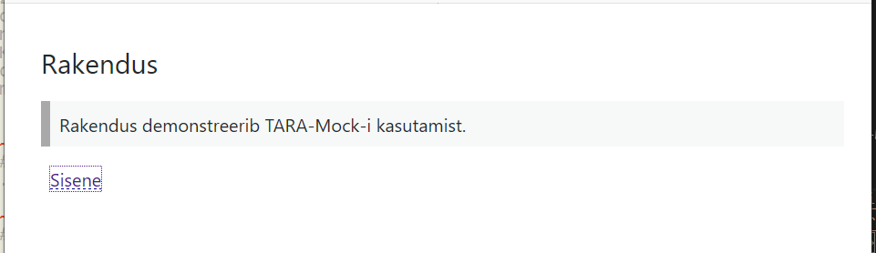
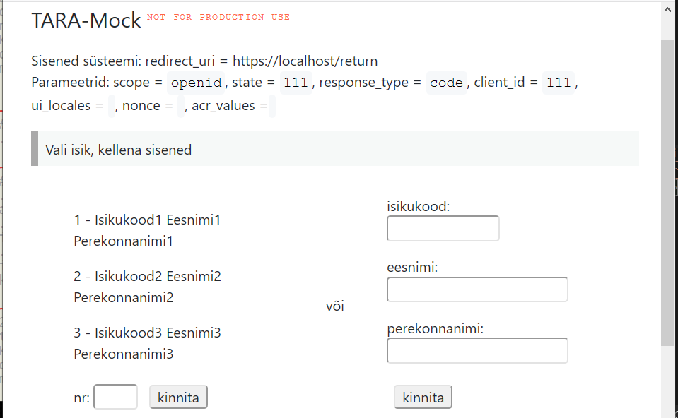
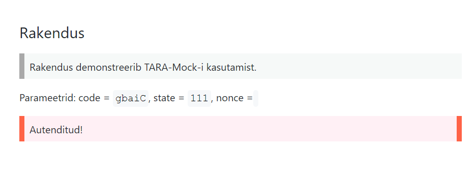

# TARA-Mock

TARA-Mock on teenus, mis teeb TARA autentimise suvalise testkasutajaga, kui vaja, siis ka inimese sekkumiseta. 

[Ülevaade](#ülevaade) · 
[Kasutusstsenaarium](#kasutusstsenaarium) · 
[Lihtsustused](#lihtsustused) · 
[Kasutamine](#kasutamine) · 
[Paigaldamine](#paigaldamine) · 
[Klientrakenduse näidis](#klientrakenduse-näidis) · 
[Turvalisus](docs/Turvalisus.md)

## Ülevaade

TARA-Mock on mõeldud kasutamiseks siis, kui [TARA testteenuse](https://e-gov.github.io/TARA-Doku/Testimine) võimalused jäävad klientrakenduse testimisel napiks.

TARA testteenusega saab autentida ainult väga väikese hulga TARA poolt ette antud testkasutajatega.

TARA-Mock seevastu võimaldab kasutajal valida autentimise dialoogis identiteet TARA-Mock seadistuses etteantud identiteetide hulgast või sisestada ise isikukood, ees- ja perekonnanimi, mille all soovitakse sisse logida. Sisuliselt saab sisse logida ükskõik millise identiteediga.

TARA-Mock-i abil saab autentimise ka täiesti automeerida: kasutaja autenditakse etteantud identiteediga, autentimise dialoogi vahele jättes. See võimalus on kasulik automaattestimisel.

TARA-Mock on reaalse TARA-ga ühilduv, s.t TARA-Mock ja TARA on üksteisega vahetatavad lihtsa seadistamisega.

TARA-Mock juures on ka klientrakenduse näidis.

TARA-Mock ei ole mõeldud kasutamiseks toodangus. TARA-Mock ei ole mõeldud ka TARA-ga liidestamise testimiseks, sest TARA-Mock-is on ära jäetud mitmeid toodangus vajalikke kontrolle (vt allpool). TARA-ga liidestamise testimiseks on [TARA testteenus](https://e-gov.github.io/TARA-Doku/Testimine).

TARA-Mock on kirjutatud Go-s.

TARA-Mock-i kasutatakse muuhulgas Valimiste infosüsteemi testimisel.

## Kasutusstsenaarium

1) Suunamine autentimisele



2) Autentimisdialoog



3) Tagasi autentimiselt



## Lihtsustused

TARA-Mock on tehtud rida lihtsustusi ja jäetud ära kontrolle:

- aktsepteeritakse kõiki klientrakendusi (`client_id` väärtust ei kontrollita)
- klientrakenduse eelnev registreerimine ei ole nõutav
- turvaelemendid (`state` ja `nonce`), samuti `return_uri`, antakse ühes sammus edasi HTML vormi peidetud väljadena
- puudub päringuvõltsimise kaitse (CSRF). Märkus: Kuna TARA-Mock-s saab sisse logida suvalise kasutajana, siis ei ole kaitsel ka mõtet.
- juhusõned genereeritakse tavalise (`math/rand`), mitte krüptograafilise juhuarvugeneraatoriga (`crypto/rand`)
- klientrakenduse salasõna ei kontrollita
- parameetreid `scope` ja `response_type` ei kontrollita
- parameetrid `ui_locales` ei kontrollita ega toetata; TARA-Mock-i kasutajaliides on eesti keeles
- parameetrit `acr_values` ei kontrollita; identsustõend väljastatakse alati väite (_claim_) `acr` (tagatistase) väärtusega `high`
- identsustõendi väljastamisel `return_uri` ei kontrollita; identsustõend väljastatakse ainult volituskoodi alusel
- identsustõendi väljastamisel ei kontrollita, kas tõend on aegunud; tõendile järeletulemise aeg ei ole piiratud
- identsustõendite hoidlat ei puhastata aegunud tõenditest
- ei kontrollita, et identsustõend väljastatakse ainult üks kord
- isikukoodi vastavust Eesti isikukoodi standardile ei kontrollita; kui `date_of_birth` väärtust ei saa isikukoodist moodustada, siis tagastatakse väärtus `1961-07-12`
- ei lisa identsustõendi väites `sub` väljastatavale isikukoodile riigikoodi (eesliitena). TARA lisab alati riigikoodi, nt `EE`. Kui rakenduses soovitakse riigikoodi kasutada, siis peavad riigikoodid olema juba etteantud identiteetides, isikukoodi sisestamisel kasutaja poolt aga peab kasutaja ise lisama riigikoodi.
- ei kontrollita, kas isik on elus või üldse olemas
- ei kontrollita sisestatud nimede vastavust keelenormile
- autentimismeetodina näidatakse alati `mID`
- TARA-Mock-is ei ole teostatud UserInfo otspunkt (autenditud kasutaja andmete küsimine pääsutõendiga (_access token_)). TARA pakub UserInfo otspunkti, kuid selle kasutamine ei ole soovitatav. Kõik vajalikud andmed saab kätte juba identsustõendist

Mida siis kontrollitakse?

- `state` ja `nonce` peegeldatakse tagasi, nii nagu OIDC protokoll ette näeb
- `return_uri` peab olema kehtiv - muidu ei jõua kasutaja rakendusse tagasi
- vormikohaselt täidetakse kogu TARA kasutusvoog (v.a UserInfo otspunkt)
- identsustõend allkirjastatakse, allkirja kontrollimise võti on võtmeotspunktis
- TARA-Mock teeb mõningaid kontrolle, logib konsoolile


## Kasutamine

TARA-Mock pakub otspunkte:

- `/health` - elutukse
- `/` - avaleht teabega TARA-Makett kohta
- `/oidc/.well-known/openid-configuration` - teenuseteabe otspunkt
- `/oidc/authorize` - autentimisele suunamine
- `/token` - identsustõendi väljastamine
- `/oidc/jwks` - identsustõendi avalik võti

Nt TARA-Mock kasutamisel oma masinas: `https://localhost:8080/health`.

Otspunktide poole pöördumine on samasugune TARA (või test-TARA) poole pöördumisega, ühe täiendusega: automaatautentimist soovides tuleb autentimisele suunamise päringus (`/oidc/authorize`) lisada query-parameeter `autologin=<isikukood>`. TARA-Mock kontrollib, kas isikukoodiga isik on etteantud identiteetide hulgas; kui ei ole, siis väljastab identsutõendi isikule `Auto Maat`.

## Paigaldamine

1 Masinas peab olema paigaldatud Go, versioon 1.12 või hilisem.

2 Klooni repo [https://github.com/e-gov/TARA-Mock](https://github.com/e-gov/TARA-Mock) masinasse.

3 Otsusta, kus hakkad hoidma TARA-Mock-i seadistust ("konfi"), võtmeid ja etteantud identiteete. Vaikimisi on seadistus koodirepos failis `config.json`, võtmed repo kaustas `service/vault` ja etteantud identiteedid repo juurkaustas failis `identities.json`. Koodiuuenduste tõmbamisega kirjutatakse need tehised üle. Seetõttu on parem seadistust hoida koodirepost eraldi. Kanna `config.json` ja `identities.json` eraldi seadistuskausta, nt `TARA-Mock-conf`; moodusta sinna ka võtmed. Etteantud identiteetide fail `identities.json` ei peab asuma seadistuskaustas; asukohta saab seadistusfailis määrata.

Seadistusfaili asukoht näita TARA-Mock-i käivitamisel võtmega `-conf`, nt:

```
go run . -conf ../../TARA-Mock-conf/config.json
```

4 Kui soovid, muuda etteantud identiteete.

TARA-Mock-is määrab kasutaja ise identiteedi (isikukoodi, ees- ja perekonnanime), millega ta autenditakse. Selleks ta kas valib etteantud identiteetide hulgast või sisestab ise identiteeti.

Tarkvaraga on kaasas 3 etteantud identiteeti. Etteantud identiteetide muutmiseks redigeeri faili `service/identities.json`.

Väljavõte failist `service/identities.json`:

```json
[
  {
    "isikukood": "Isikukood1",
    "eesnimi": "Eesnimi1",
    "perekonnanimi": "Perekonnanimi1"
  },
```

TARA väljastab identsustõendis, väiteks `sub` isikukoodi koos eesliitega, milles on riigikood, nt `EE`. Kui soovid samamoodi, siis lisa ise isikukoodi ette `EE`.
 
Muudatusi saab teha ka hiljem. Siis tuleb TARA-Mock uuesti käivitada.

5 Kontrolli ja vajadusel muuda TARA-Mock-is seadistatud hostinimesid ja porte. Vaikeseadistus on tehtud eeldustel:

- TARA-Mock töötab arendaja masinas (`localhost`), pordil `8080`, baas-URL-il `/`.

Muuda failis `service/config.json` olev vaikeseadistus oma konfiguratsioonile vastavaks:

```json
{
	"taraMockHost": "localhost",
	"httpServerPort": ":8080",
  "baseHref": "/",
	"taraMockCert": "vault/https.crt",
	"taraMockKey": "vault/https.key",
	"idTokenPrivKeyPath": "vault/idtoken.key",
	"idTokenPubKeyPath": "vault/idtoken.pub",
	"kid": "taramock",
	"identitiesFile": "identities.json",
	"authenticateUserTmpl": "templates/authenticateUser.html",
  "indexTmpl": "templates/index.html",
  "logLevel": "INFO"
}
```

`logLevel` on TARA-Mock-is tehtava logimise tase. Logitase määratakse TARA-Mock seadistuses, väljas `logLevel` või kasutatakse vaikimisi logitaset. Kasutada saab logitasemeid (detailsemalt kompaktsemale):  `TRACE`, `DEBUG`, `INFO`, `WARNING`, `ERROR`, `FATAL` ja `PANIC`. Vaikimisi, s.t kui logitaset ei ole seadistusfailis määratud, samuti kui seadistusfailis määratu parsimine ebaõnnestub, kasutab TARA-Mock logitaset `INFO`.

6 Valmista ja paigalda võtmed ja serdid, vt [Turvalisus](docs/Turvalisus.md)

  - sh lisa sirvikusse TARA-Mock-i CA sert.

7 Käivita TARA-Mock:

```
cd service
go run -conf <seadistusfail>
```

8 Liidesta klientrakendus TARA-Mock-ga. Selleks tuleb klientrakenduse konfiguratsioonis seada:

- TARA-Mock-i hostinimi ja port. Otspunktide nimed on samad, mis TARA-s, neid ei ole vaja muuta.
- Kui kasutad TARA-Mock-i instantsi, mis ei ole sinu kontrolli all, siis ära kasuta test-TARA klientrakenduse salasõna; sea salasõnaks muu väärtus; TARA-Mock ei kontrolli salasõna.
- TARA-Mock-i CA sert usaldusankruks (s.t klientrakendus tuleb panna TARA-Mock-i usaldama).

## Käivitamine kasutades Docker'it

```
docker-compose up
```

Vaikimisi eeldatakse, et võtmed ja serdid asuvad repo kaustas `service/vault`. Võtmeid ja serte saab eelnevalt genereerida käivitades käsud:  

```
docker-compose build --build-arg genkeys="true"
docker-compose up
```

## Klientrakenduse näidis

TARA-Mock-ga kaasasolev klientrakenduse näidis pakub otspunkte:

- `/health` - elutukse
- `/` - avaleht; kasutaja saab sealt minna TARA-Mock-i autentima
- `/login` - kasutaja suunamine TARA-Mock-i autentima
- `/autologin` - kasutaja suunamine TARA-Mock-i autentima
- `/return` - autentimiselt tagasi suunatud kasutaja vastuvõtmine, identsustõendi pärimine TARA-Mock-st ja sisselogimise lõpuleviimine 

Klientrakenduse kasutamiseks:

1 Masinas peab olema paigaldatud Go, versioon 1.12 või hilisem.

2 Klooni repo [https://github.com/e-gov/TARA-Mock](https://github.com/e-gov/TARA-Mock) masinasse.

3 Kontrolli ja vajadusel muuda vaikeseadistus vastavaks oma konfiguratsioonile. Vaikeseadistus on tehtud eeldustel:

- TARA-Mock-i hostinimi on `localhost` ja port on `8080`
- klientrakenduse hostinimi on `localhost` ja port on `8081`

Seadistamine on analoogiline TARA-Mock-i seadistamisega.

4 Valmista ja paigalda võtmed ja serdid, vt lähemalt [Turvalisus](docs/Turvalisus.md)

5 Käivita klientrakendus:

```
cd client -conf <seadistusfail>
go run .
```

6 Ava sirvikus klientrakenduse avaleht (vaikimisi `https://localhost:8081`)
